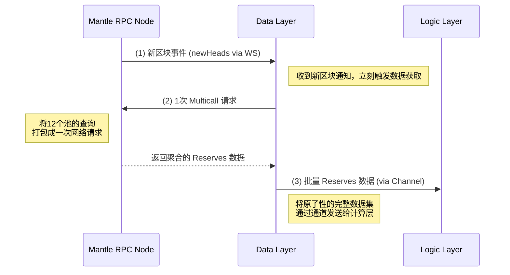

# Data Synchronization Layer (数据层)

This module implements the high-performance data synchronization architecture as described in the design document. It follows the **proactive aggregated polling approach (方案A)** for optimal performance in high-frequency arbitrage scenarios.

## Architecture Overview



## Key Components

### 1. WebSocket Manager (`websocket.rs`)
- Manages persistent WebSocket connection to Mantle RPC
- Subscribes to `newHeads` events
- Handles automatic reconnection with exponential backoff
- Parses block headers and extracts block numbers

### 2. Multicall Manager (`multicall.rs`)
- Integrates with Multicall3 contract for batch queries
- Prepares `getReserves()` calls for multiple pools
- Executes batch RPC calls with configurable timeouts
- Decodes aggregated responses

### 3. Data Aggregator (`aggregator.rs`)
- Combines pool data into atomic `MarketSnapshot` objects
- Validates data consistency and completeness
- Manages pool monitoring lists dynamically
- Provides performance statistics

### 4. Data Sync Service (`service.rs`)
- Main orchestrator that coordinates all components
- Provides async channels for data delivery to logic layer
- Manages service lifecycle (start/stop)
- Implements builder pattern for easy configuration

### 5. Configuration (`config.rs`)
- Environment-based configuration management
- Validation for URLs, addresses, and timeouts
- Support for different deployment environments

## Usage Examples

### Basic Usage

```rust
use swap_path::data_sync::{DataSyncServiceBuilder, DataSyncConfig};
use swap_path::logic::pools::PoolId;

#[tokio::main]
async fn main() -> eyre::Result<()> {
    // Load configuration
    let config = DataSyncConfig::from_env()?;
    
    // Define pools to monitor
    let pools = vec![
        PoolId::Address("0x1234...".parse()?),
        PoolId::Address("0x5678...".parse()?),
    ];
    
    // Create and start service
    let mut service = DataSyncServiceBuilder::new()
        .with_config(config)
        .with_pools(pools)
        .build()
        .await?;
    
    // Start receiving market data
    let mut market_data_rx = service.start().await?;
    
    // Process market snapshots
    while let Some(snapshot) = market_data_rx.recv().await {
        println!("Block {}: {} pools updated", 
                 snapshot.block_number, 
                 snapshot.pool_reserves.len());
        
        // Send to your arbitrage logic
        process_arbitrage_opportunities(&snapshot).await;
    }
    
    // Graceful shutdown
    service.stop().await?;
    Ok(())
}
```

### Dynamic Pool Management

```rust
// Add new pools at runtime
service.add_monitored_pool(new_pool_id).await;

// Remove pools
service.remove_monitored_pool(&pool_id).await;

// Update ETH price for gas calculations
service.set_eth_price_usd(2500.0).await;

// Get service statistics
let stats = service.get_stats().await;
println!("Monitoring {} pools", stats.monitored_pools_count);
```

## Configuration

Environment variables supported:

```bash
# RPC endpoints
RPC_WSS_URL=wss://rpc.mantle.xyz
RPC_HTTP_URL=https://rpc.mantle.xyz

# Multicall contract
MULTICALL_ADDRESS=0xcA11bde05977b3631167028862bE2a173976CA11

# Performance tuning
MAX_POOLS_PER_BATCH=50
WS_CONNECTION_TIMEOUT_SECS=30
HTTP_TIMEOUT_SECS=10
CHANNEL_BUFFER_SIZE=100

# Reliability
MAX_RECONNECT_ATTEMPTS=5
RECONNECT_DELAY_SECS=2
```

## Performance Characteristics

### Latency (设计目标)
- **Sub-second response time**: From new block to data ready
- **Single network roundtrip**: Multicall aggregates all pool queries
- **Atomic data consistency**: All reserves from same block height

### Throughput
- **50+ pools per batch**: Configurable batch size
- **2-second block time**: Optimized for Mantle's block frequency
- **Automatic load balancing**: Splits large pool sets into batches

### Reliability
- **Automatic reconnection**: Handles network interruptions
- **Graceful degradation**: Continues with partial data if some pools fail
- **Error isolation**: Pool query failures don't affect others

## Integration with Logic Layer

The data layer provides `MarketSnapshot` objects to the logic layer via async channels:

```rust
pub struct MarketSnapshot {
    pub pool_reserves: HashMap<PoolId, (U256, U256)>,
    pub timestamp: u64,
    pub block_number: u64,
    pub eth_price_usd: f64,
}
```

Each snapshot represents an atomic view of the market at a specific block height, ensuring consistency for arbitrage calculations.

## Testing

Run the test suite:

```bash
# Unit tests
cargo test data_sync::tests::unit_tests

# Integration tests
cargo test data_sync::tests::integration_tests

# Performance tests
cargo test data_sync::tests::performance_tests

# Run example
cargo run --example data_layer_example
```

## Future Enhancements

1. **Price Oracle Integration**: Dynamic ETH price updates
2. **Pool Discovery**: Automatic detection of new pools
3. **Historical Data**: Block-by-block data replay
4. **Metrics Export**: Prometheus/Grafana integration
5. **Multi-chain Support**: Extend beyond Mantle

## Architecture Benefits

This implementation achieves the design goals:

- ✅ **Low Latency**: Single network roundtrip per block
- ✅ **Atomicity**: All data from same block height
- ✅ **High Efficiency**: Minimal RPC pressure, batched queries
- ✅ **Robustness**: Auto-reconnection, error handling, graceful degradation

The proactive approach ensures maximum speed for high-frequency arbitrage operations while maintaining data consistency and system reliability.
