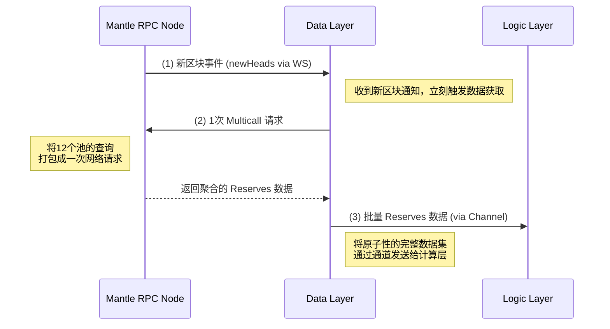

# 套利系统数据层设计文档

## 1\. 概述 (Overview)

数据层是整个套利系统的基石，其核心使命是为上层逻辑（计算层）提供**及时、准确、原子化**的链上市场数据。对于高频套利系统而言，数据层的性能直接决定了整个策略的生死。

本文档旨在设计一个适用于 Mantle 链（区块时间 ≈ 2s）的高性能数据层，专注于监控一组特定的流动性池（例如 12 个 MoeLP 池），并对两种主流实现思路进行深入探讨和对比。

## 2\. 核心设计目标

  - **低延迟 (Low Latency):** 从新区块产生到数据准备就绪的时间必须最小化。
  - **原子性 (Atomicity):** 所有被监控的池子状态（`reserves`）必须来自同一个区块高度，以防范数据不一致导致的计算错误。
  - **高效率 (High Efficiency):** 最小化对 RPC 节点的请求压力和自身的资源消耗。
  - **健壮性 (Robustness):** 能够处理 RPC 连接中断等异常情况，具备自动重连和错误恢复能力。

-----

## 3\. 设计方案对比

我们评估了两种主流的数据获取方案：

  - **方案 A: 主动式聚合拉取 (Proactive Aggregated Polling)**
  - **方案 B: 反应式交易解析 (Reactive Transaction Parsing)**

### 3.1 方案 A: 基于 `Multicall` 和 `WebSocket` 订阅的主动式聚合拉取 (推荐)

这是行业内高性能链上数据监控系统的**最佳实践 (Best Practice)**。

#### **架构图**

#### **工作流程**

1.  **连接与订阅 (Connect & Subscribe):**

      - 系统启动时，与 Mantle RPC 节点 (.env 中的 `RPC_WSS_URL`)建立一个**持久化的 WebSocket 连接**。
      - 订阅 `newHeads` 事件。此后，每当有新区块产生，RPC 节点会主动推送通知。

2.  **数据准备 (Preparation):**

      - 预先为所有 12 个目标池地址 (/data/selected/)，ABI 编码好 `getReserves()` 函数的调用数据 (calldata)。

3.  **事件触发与聚合调用 (Event Trigger & Aggregation):**

      - 当收到 `newHeads` 事件时，立刻触发数据获取逻辑。
      - 将 12 组 `(poolAddress, calldata)` 打包成一个列表，向链上的 `Multicall` 合约发起**一次性**的 `eth_call` 调用。

4.  **数据解码与传递 (Decode & Deliver):**

      - `Multicall` 合约返回一个包含所有结果的聚合字节流。
      - 数据层解码此字节流，得到 12 个池子的 `(reserveA, reserveB)` 数据。
      - 将这个**包含了完整、原子性状态**的数据集，通过一个**异步通道 (Channel/Queue)** 发送给逻辑层。

#### **优点**

  - **极致的低延迟:** 整个流程的核心延迟只有一个网络来回（`Multicall` 请求），这是获取全量数据的理论最快速度。
  - **完美的数据原子性:** `Multicall` 保证返回的所有 `reserves` 数据都来自同一个区块，确保了决策依据的一致性。
  - **实现简单且稳健:** 逻辑清晰，依赖少，没有复杂的解码和状态追踪，易于构建和维护。
  - **对 RPC 节点友好:** 每个区块只产生一次轻量级的 `eth_call`，不易触发限流。

#### **缺点**

  - **存在冗余请求:** 即使某个区块中没有任何目标池发生交易，系统依然会发起一次 `Multicall` 调用。

### 3.2 方案 B: 基于区块解析的反应式处理

这是一个看似更“智能”的方案，只在状态确实发生变化时才行动。

#### **工作流程**

1.  **订阅新区块 (Subscribe to New Blocks):**

      - 同样通过 WebSocket 订阅新区块。
      - 但这次需要获取的是包含**所有交易**的完整区块体。

2.  **解析与过滤 (Parse & Filter):**

      - 收到新区块后，在本地 CPU 中遍历区块内的每一笔交易。
      - 检查交易的 `to` 地址是否为目标池地址，或者更复杂地，解码交易的 `input data` 以判断其是否通过路由合约与目标池交互。

3.  **触发式获取 (Triggered Fetch):**

      - 如果识别到一笔或多笔影响目标池的交易，则针对这几个发生变化的池子，再发起 `getReserves` 的 `eth_call` 请求。

4.  **数据传递:**

      - 将获取到的更新后的 `reserves` 数据传递给逻辑层。

#### **优点**

  - **减少 `getReserves` 调用:** 只有在确定池子有交互时才去查询，避免了在空闲区块的无效 RPC 调用。

#### **缺点**

  - **引入了更高的延迟（致命缺陷）:** 整个流程变为 `网络延迟(获取完整区块) + CPU延迟(解析所有交易) + 网络延迟(获取Reserves)`。这个总时长几乎肯定比方案 A 的单次网络延迟要长得多，在高频套利中是不可接受的。
  - **实现复杂度极高:** 需要一个强大的交易解码器，能处理各种路由合约的复杂调用，非常容易出错且难以维护。
  - **RPC 负载更重:** 获取完整区块的请求 (`eth_getBlockByNumber` with full transactions) 是一个比 `eth_call` **重得多**的 RPC 请求。
  - **数据同步性差:** 当你解析完交易时，状态已经是“过去时”。更糟的是，如果一个区块内有两笔交易影响了同一个池子，你的解析和后续的 `getReserves` 很难精确地捕捉到中间状态。

-----

## 4\. 最终决策与对比总结

| 对比维度 | 方案 A (`Multicall`) | 方案 B (解析交易) | 结论 |
| :--- | :--- | :--- | :--- |
| **延迟** | **极低** | 高 | **方案 A 完胜** |
| **实现复杂度** | 低 | 非常高 | **方案 A 完胜** |
| **RPC 负载** | 轻量级、高频次 | 重量级、低频次 | 方案 A 对节点更友好 |
| **数据同步性** | **完美** | 较差 | **方案 A 完胜** |
| **资源消耗** | 少量网络带宽 | 大量网络带宽 + 大量 CPU | 方案 A 更轻量 |

**结论：**

对于高频套利系统，**延迟是压倒一切的考量因素**。

方案 B（解析交易）试图通过增加计算复杂度和处理延迟，来优化一个相对次要的问题（RPC 请求冗余）。这在套利场景下是典型的**过度设计 (Over-engineering)** 和**错误优化 (Mis-optimization)**。

我们愿意接受每个区块一次的轻微冗余，来换取决策数据的**极致速度**和**绝对可靠**。

因此，**最终推荐并采纳方案 A: 基于 `Multicall` 和 `WebSocket` 订阅的主动式聚合拉取方案**。它是在性能、可靠性和实现成本之间取得最佳平衡的理想选择。